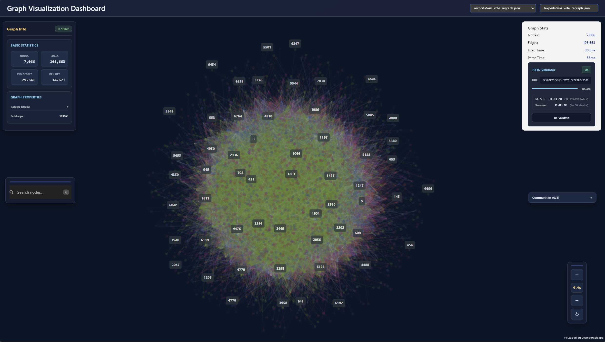
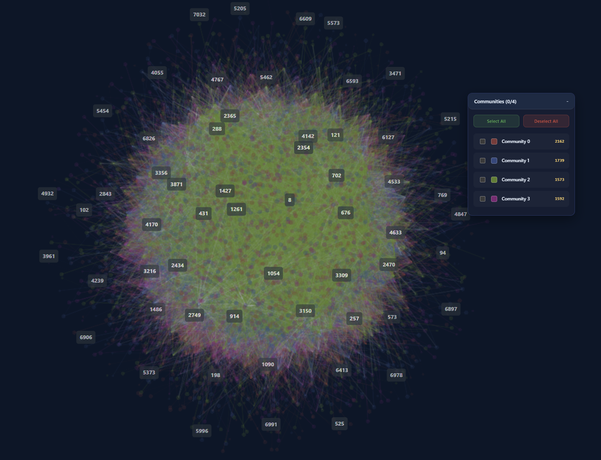
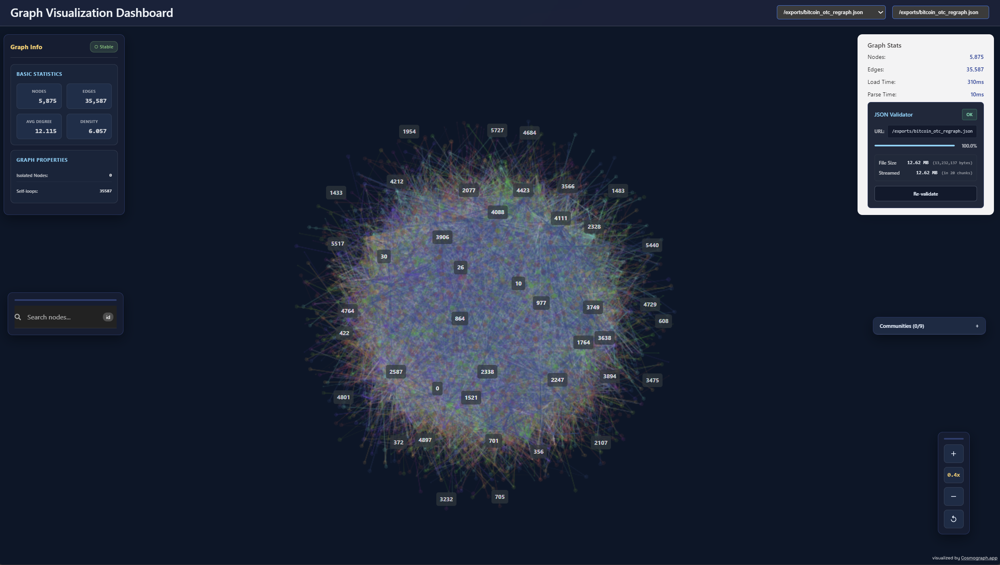
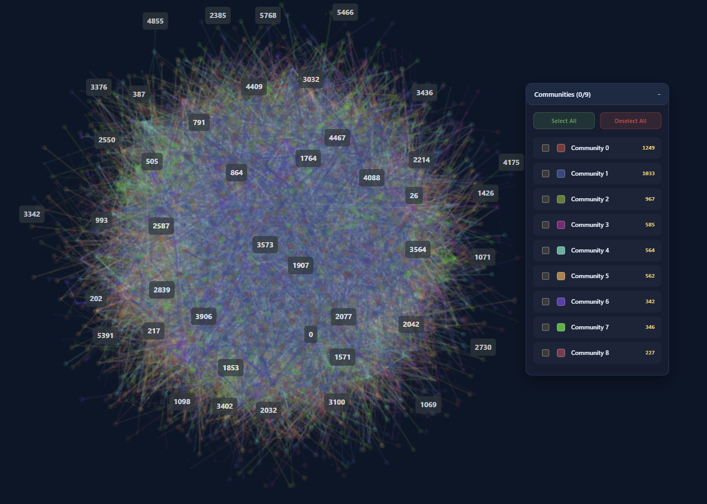
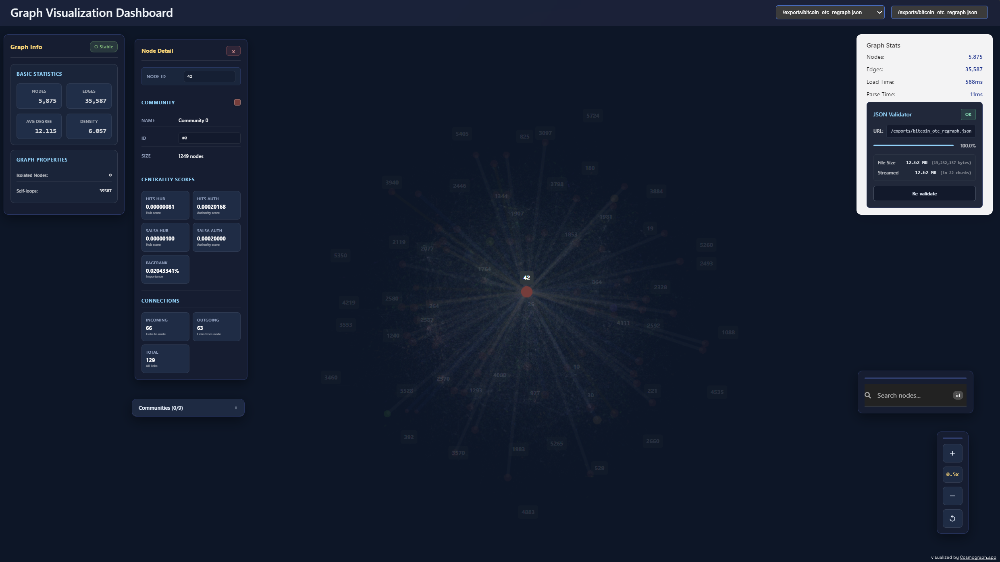
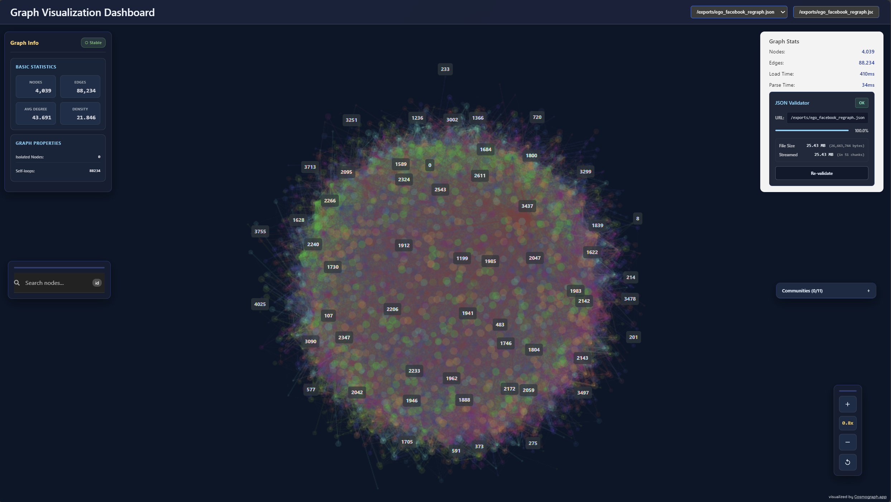
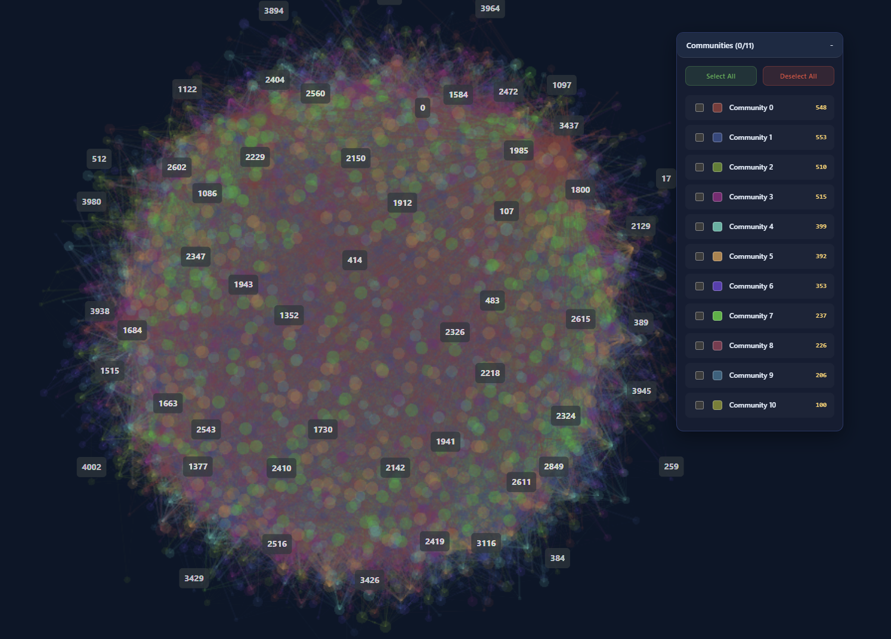
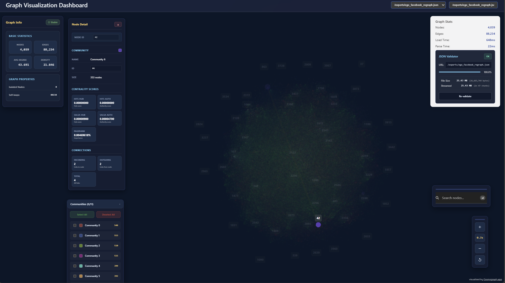

# Graph Visualization Dashboard

This document contains the mathematical formulations for graph analysis algorithms implemented in the dashboard.

## Visualization Examples

### Wiki Vote Network
Wikipedia administrator election network showing voting patterns and political structures.

<table>
<tr>
<td></td>
<td></td>
<td></td>
</tr>
<tr>
<td align="center"><em>Network structure</em></td>
<td align="center"><em>Detected communities</em></td>
<td align="center"><em>Centrality analysis</em></td>
</tr>
</table>

### Bitcoin OTC Trust Network
Trust relationships in Bitcoin OTC marketplace with mutual trust circles.

<table>
<tr>
<td></td>
<td></td>
<td></td>
</tr>
<tr>
<td align="center"><em>Trust network</em></td>
<td align="center"><em>Trust communities</em></td>
<td align="center"><em>Trust metrics</em></td>
</tr>
</table>

### Facebook Social Network
Friendship connections revealing social circles and community structures.

<table>
<tr>
<td></td>
<td></td>
<td></td>
</tr>
<tr>
<td align="center"><em>Friendship network</em></td>
<td align="center"><em>Social clusters</em></td>
<td align="center"><em>Influence metrics</em></td>
</tr>
</table>

## Community Detection Algorithm

### Louvain Method

Modularity measures link density within communities versus between them:

$$Q = \frac{1}{2m} \sum_{i,j} \left[A_{ij} - \frac{k_i k_j}{2m}\right] \delta(c_i, c_j)$$

where $A_{ij}$ is adjacency matrix, $k_i = \sum_j A_{ij}$ is node degree, $m = \frac{1}{2} \sum_{ij} A_{ij}$ is total edges, and $\delta(c_i, c_j) = 1$ if nodes share community.

**Modularity Change** when moving node $i$ to community $C$:

$$\Delta Q = \left[\frac{\sum_{in} + 2k_{i,in}}{2m} - \left(\frac{\sum_{tot} + k_i}{2m}\right)^2\right] - \left[\frac{\sum_{in}}{2m} - \left(\frac{\sum_{tot}}{2m}\right)^2 - \left(\frac{k_i}{2m}\right)^2\right]$$

where $\sum_{in}$ = internal link weights, $\sum_{tot}$ = total link weights to $C$, $k_{i,in}$ = weights from $i$ to $C$.

**Algorithm:** Initialize nodes separately → Move to maximize $\Delta Q$ → Aggregate communities → Repeat until convergence.

### Community-Aware Edge Reweighting

For source node $i$, distinguish intra-community edges ($m_i$) and inter-community edges ($n_i$). Define normalization constant:

$$C_i = \delta \cdot m_i + n_i$$

Edge weights assigned as: 
- Intra-community: $w_{ij} = \delta / C_i$
- Inter-community: $w_{ij} = 1 / C_i$

Parameter $\delta < 1$ emphasizes bridges; $\delta > 1$ emphasizes cohesion; $\delta = 1$ treats edges equally.

### Community PageRank Weighting

Compress node graph into community graph where $C[a,b]$ counts edges from community $a$ to $b$. Run PageRank on community graph:

$$PR_{\text{comm}}[c] = \frac{1-\alpha}{N_c} + \alpha \sum_{c' \to c} \frac{PR_{\text{comm}}[c']}{L(c')}$$

For edge $(u \to v)$ with target community $c_v$:
- Intra-community: $w_{uv} = (\delta \cdot f(PR[c_v])) / C_u$
- Inter-community: $w_{uv} = f(PR[c_v]) / C_u$

where $f$ is score transformation and $C_u = \delta \cdot m_u + n_u$.

## Centrality Algorithms

### PageRank Algorithm

Node importance via recursive propagation:

$$PR(p) = \frac{1-d}{N} + d \sum_{q \in M(p)} \frac{PR(q)}{L(q)}$$

**Matrix Form:** $\mathbf{PR}^{(t+1)} = \frac{1-d}{N}\mathbf{1} + d\mathbf{M}\mathbf{PR}^{(t)}$

**Convergence:** $\|\mathbf{PR}^{(t+1)} - \mathbf{PR}^{(t)}\|_1 < \epsilon$ with $\epsilon = 10^{-8}$, $d = 0.85$ damping factor.

### HITS Algorithm

Hub and authority scores through mutual reinforcement:

$$a^{(k+1)}(p) = \sum_{q: q \to p} h^{(k)}(q), \quad h^{(k+1)}(p) = \sum_{q: p \to q} a^{(k+1)}(q)$$

**Matrix Form:** $\mathbf{a}^{(k+1)} = \mathbf{A}^T \mathbf{h}^{(k)}$, $\mathbf{h}^{(k+1)} = \mathbf{A} \mathbf{a}^{(k+1)}$

**Normalization:** $\mathbf{a}^{(k+1)} \leftarrow \mathbf{a}^{(k+1)} / \|\mathbf{a}^{(k+1)}\|_2$, $\mathbf{h}^{(k+1)} \leftarrow \mathbf{h}^{(k+1)} / \|\mathbf{h}^{(k+1)}\|_2$

Convergence when both authority and hub L2 changes fall below $10^{-6}$.

### SALSA Algorithm

Stochastic random walks on hub-authority graphs:

$$\mathbf{P}_h = \mathbf{W}_r \mathbf{W}_c^T, \quad \mathbf{P}_a = \mathbf{W}_c^T \mathbf{W}_r$$

**Stationary Distributions:** $\boldsymbol{\pi}_h = \mathbf{P}_h \boldsymbol{\pi}_h$, $\boldsymbol{\pi}_a = \mathbf{P}_a \boldsymbol{\pi}_a$

where $\mathbf{W}_r$ and $\mathbf{W}_c$ are row/column-normalized adjacency matrices. Resistant to manipulation through link spamming.

**Damping (teleportation):**
Update: $\mathbf{x}_{\text{next}} \leftarrow (1-\alpha)\,\mathbf{x}_{\text{next}} + \alpha \cdot \frac{1}{N}$

**Convergence:** L1 norm $\|\mathbf{x}^{(t+1)} - \mathbf{x}^{(t)}\|_1 < 10^{-9}$ with Krasnoselskii averaging when residuals increase.

## Distance-Based Edge Weighting

### Minimal Backward Distance (MinBD)

For directed edge $(u \to v)$, compute shortest path from $v$ back to $u$:

$$\text{MinBD}(u \to v) = \min\{\text{length of path } v \rightsquigarrow u\}$$

Small MinBD indicates tight feedback loops; large/infinite MinBD indicates one-way structure.

**Edge Weight Assignment:** $w(u\to v)=f(d(u\to v))$ where $f$ is a distance weight function (default: $f(d)=\frac{1}{1+d}$).

**Normalization:** $w_{\text{norm}}(u \to v) = w(u \to v) / \max(1, \text{outdeg}(u))$ then row-stochastic normalization.

**DFS-Based Computation:** Detect cycles via back edges, compute distances through path tracking, clamp at max_distance (default 30).

## Network Topology Metrics

### Clustering Coefficient

**Local:** $C_i = \frac{2T_i}{k_i(k_i - 1)}$ where $T_i$ = triangles through node $i$

**Global:** $C = \frac{3 \times \text{triangles}}{\text{connected triples}}$

Measures network transitivity and small-world properties.

### Degree Distribution

**Power Law:** $P(k) \sim k^{-\gamma}$

**MLE Estimator:** $\hat{\gamma} = 1 + n\left[\sum_{i=1}^n \ln\frac{k_i}{k_{\min} - 0.5}\right]^{-1}$

Values $\gamma \in [2,3]$ typical for real networks.

### Forces

Definitions: $\mathbf{r}_{ij}=\mathbf{p}_j-\mathbf{p}_i$, $r_{ij}=\|\mathbf{r}_{ij}\|$, $\mathbf{u}_{ij}=\mathbf{r}_{ij}/r_{ij}$.

Repulsive: $\mathbf{F}_{\text{rep}}(i,j) = -C\,\frac{k^2}{r_{ij}}\,\mathbf{u}_{ij}$

Attractive: $\mathbf{F}_{\text{att}}(i,j) = k_a\,r_{ij}\,\mathbf{u}_{ij}$

**Approximation:**

$\frac{s}{d} < \theta$

Groups distant nodes, reduces $O(n^2)$ to $O(n \log n)$

**System Energy:**

$E = \sum_{i<j} \frac{k^2}{r_{ij}} + \sum_{(i,j) \in E} \frac{r_{ij}^2}{2k} \ln r_{ij}$

Layout minimizes energy through iterative force application.

## Implementation Pipeline

### Community Detection Flow

```
Adjacency Matrix → Modularity Calculation → Local Optimization → Aggregation → Iteration
```

**Supported Methods:** Louvain (default), Label Propagation, Greedy Modularity, Leiden, K-core, SCC

**Process:** Move nodes to maximize $\Delta Q$ → Aggregate into super-nodes → Repeat until convergence

### Centrality Computation

```
Graph → Adjacency Processing → Parallel GPU Iteration → Normalization
```

**GPU Acceleration:** Sparse matrix operations on CUDA with batched power iteration

**Convergence:** PageRank L1 $< 10^{-8}$, HITS L2 $< 10^{-6}$, SALSA L1 $< 10^{-9}$

### Weight Normalization

Row-stochastic normalization ensures $\sum_v w(u \to v) = 1$ for all nodes $u$:

$$w_{\text{norm}}(u \to v) = \frac{w(u \to v)}{\sum_{v'} w(u \to v')}$$

Applied after all edge reweighting operations.

## Performance Optimizations

**Algorithmic:**
- Sparse CSR format: $O(E)$ memory vs $O(N^2)$
- Barnes-Hut approximation: $O(n \log n)$ force calculation
- Incremental updates: Continue from current state
- GPU batch processing: 1024 vectors in parallel

**Memory Management:**
- Streaming JSON parser for >1GB graphs
- Lazy computation for visible nodes only
- Progressive rendering by degree centrality

## Results Analysis

**Wiki Vote Network:**
- Modularity ~0.45 with 8-12 communities
- Power-law degree distribution
- Clear voting blocs detected
- Few highly influential voters

**Bitcoin OTC Trust Network:**
- Distinct trust circles with boundaries
- Key traders as intermediaries
- SALSA effective for manipulation resistance
- Trust propagates via stationary distribution

**Facebook Social Network:**
- Clustering coefficient >0.6
- Natural social circle separation
- Small-world property evident
- Structure from connections alone

## Validation Metrics

**Convergence:** Explicit threshold checks for all iterative methods

**Stability:** Multiple random seeds for community detection

**Boundary Cases:** Isolated nodes, disconnected components, self-loops handled

**Quality:** Modularity scores (>0.3 significant), layout energy decay, convergence rates (PageRank 50-100, HITS 30-50, Louvain <10 iterations)